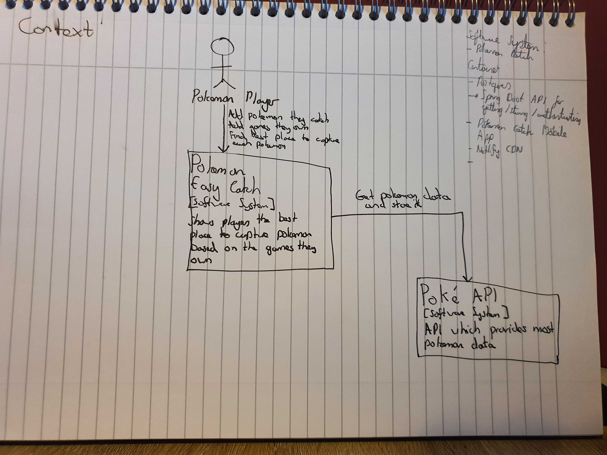

# Pokemon - Easiest Catch

## What?
I've recently took it upon myself to catch every pokemon.

As I am playing multiple games to catch all the pokemon, I find that I'm constantly looking on pokemon wiki sites to find the best way to get a pokemon.

This app tells you the easiest way to get each pokemon, depending what games you have.

## How to start locally
1. Start up emulator in Android Studio
2. Deploy application

## Technologies
App
- Flutter
- Dart
- PokeAPI

Backend (get and service data)
- Spring Boot
- Mongo

## C4

### Context

### Container

